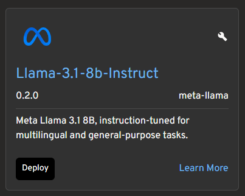

# MCP Tool Calling

Tool calling enables AI models to interact with external systems and execute functions beyond text generation. Headlamp-KAITO integrates with the Model Context Protocol (MCP) to provide powerful tool-calling capabilities directly within your Kubernetes environment.

## Overview

Tool calling allows AI models to:

- **Execute Functions**: Call predefined functions with structured parameters
- **Access External APIs**: Interact with external services and databases
- **Perform Actions**: Execute system commands and operations
- **Retrieve Real-time Data**: Access live data from various sources

#### Model Compatibility

- Note: Currently, only **Llama models** support tool calling in Headlamp-KAITO. The system provides visual indicators for tool-capable models 🔧:

  
  <!-- add red circle -->

## MCP Server Management

### Authentication Methods

Headlamp-KAITO supports MCP servers using two authentication methods:

- **Authorization Header**: Credentials are sent via HTTP headers for secure access.
- **URL Path Authentication**: Credentials are included in the endpoint URL for server authentication.

### Transport Layer

Headlamp-KAITO supports MCP servers using both **streamable HTTP** and **Server-Sent Events (SSE)** protocols. This enables real-time communication and efficient data streaming between the AI model and external tools, ensuring responsive tool execution and seamless integration.

# Adding MCP Servers

Users can add MCP servers through the management interface:

1. **Server Name**: Human-readable identifier
2. **Endpoint URL**: HTTP endpoint for the MCP server
3. **Description**: Optional description of server capabilities
4. **API Key**: Optional authentication token
5. **Auth Method**: Choose between header or URL authentication

### Server Status Monitoring

The interface shows real-time server status:

- **Connection Status**: Green indicator for connected servers
- **Tool Count**: Number of tools available from each server
- **Error States**: Visual indication of connection problems

### Configuration Persistence

MCP server configurations are stored in the component state and can be:

- **Enabled/Disabled**: Toggle servers on/off
- **Edited**: Modify server settings
- **Deleted**: Remove unused servers

## Usage Examples

### Basic Server Setup

```typescript
const server: MCPServer = {
  id: 'filesystem-server',
  name: 'File System Tools',
  endpoint: 'http://localhost:3000/mcp',
  description: 'Provides file system operations',
  enabled: true,
  apiKey: 'optional-api-key',
  authMethod: 'header',
};
```
