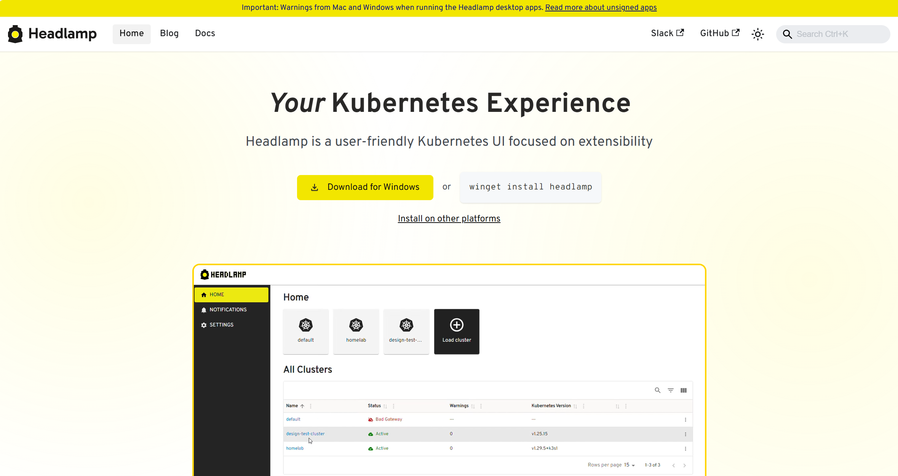
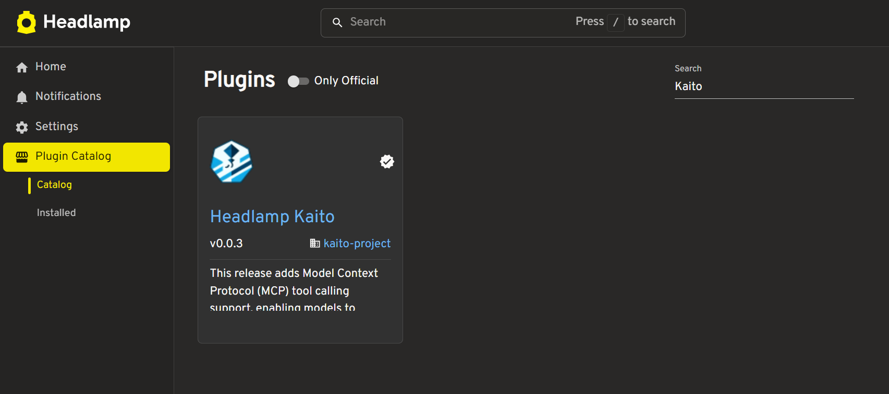
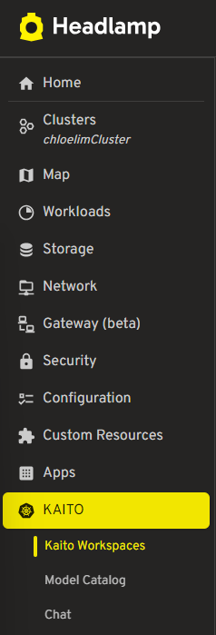

# Installation

# Prerequisites

Before installing the Headlamp-KAITO plugin, ensure your environment meets the following requirements:

| Component          | Requirement              | Purpose                             |
| ------------------ | ------------------------ | ----------------------------------- |
| Kubernetes Cluster | Version 1.20+            | Target environment for AI workloads |
| KAITO Controller   | Installed and running    | AI workload orchestration           |
| Headlamp           | Version 0.12.0 or higher | Host platform for the plugin        |

## Kubernetes Cluster with KAITO

The plugin requires a Kubernetes cluster with the Kubernetes AI Toolchain Operator (KAITO) controller installed. KAITO Kubernetes AI Toolchain Operator manages AI model deployments and GPU resources.
See guidance [here](https://kaito-project.github.io/kaito/docs/installation).

### Kubernetes Context

Ensure Headlamp is connected to a Kubernetes cluster with KAITO controller:

```bash
kubectl get workspaces -A
```

This command should return without errors, indicating proper KAITO controller installation.

## Headlamp Installation

1. Install Headlamp https://headlamp.dev/

   [](https://headlamp.dev/)

2. Verify your Headlamp installation by checking the version:

```bash
headlamp --version
```

## Headlamp-KAITO Plugin Installation

The Headlamp-KAITO plugin is distributed through Artifact Hub on Headlamp Plugin Catalog, which provides automated installation and integrity verification.



1. **Access Artifact Hub**: Navigate to the Headlamp Plugin Catlog on the left sidebar
2. **Locate Plugin**: Search for "kaito" or browse the plugins
3. **Install Plugin**: Click the install button to download and install the plugin package

#### Development Installation

For advanced users or development environments, the plugin can be installed manually:

1. **Clone Repository**: Download the plugin source code
2. **Install Dependencies**: Run `npm install` to install required packages
3. **Build Plugin**: Execute `headlamp-plugin build` to compile the plugin
4. **Package Plugin**: Use `headlamp-plugin package` to create installation archive

### Installation Verification

After installation, verify the plugin is correctly loaded:

- **Sidebar Navigation**: Navigate to your cluster and check that "KAITO" appears in the Headlamp sidebar



<!-- add red circle  -->

#### Functional Verification

| Feature        | Verification Method              | Expected Result                      |
| -------------- | -------------------------------- | ------------------------------------ |
| Workspace List | Navigate to workspace management | Display existing Kaito workspaces    |
| Model Catalog  | Access model catalog page        | Show available AI models from GitHub |
| Chat Interface | Select workspace and start chat  | Enable AI model interaction          |

### Common Installation Issues

| Issue              | Symptoms                    | Solution                              |
| ------------------ | --------------------------- | ------------------------------------- |
| Plugin Not Visible | Sidebar missing Kaito entry | Restart Headlamp after installation   |
| Route Errors       | 404 errors on plugin routes | Verify plugin archive integrity       |
| API Access Issues  | Unable to list workspaces   | Check Kubernetes cluster connectivity |

## Next Steps

After successful installation and verification:

- **Explore Model Catalog**: Browse available AI models in the catalog - see Model Catalog
- **Deploy First Model**: Follow the deployment workflow for your first AI model
- **Configure Chat Interface**: Set up AI model interactions - see Chat Interface
- **Manage Workspaces**: Learn workspace management capabilities - see Workspace Management
